<!-- Banner -->

<!-- Typing SVG -->

<!-- Badges -->

---

## 👨‍💻 About Me

  

---

## 🛠️ Tech Stack

---

## ⛓️ Web3 Journey

🔭 Exploring smart contracts, dApps, and the decentralized web, one block at a time.

---

## 📊 GitHub Stats

---

## 🐍 Contribution Snake

<picture>
  <source media="(prefers-color-scheme: dark)" srcset="https://raw.githubusercontent.com/zann06/zann06/output/github-snake-dark.svg" />
  <source media="(prefers-color-scheme: light)" srcset="https://raw.githubusercontent.com/zann06/zann06/output/github-snake.svg" />
  
</picture>

---

## 🌐 Connect with Me

  
  

---

*"Code is like humor. When you have to explain it, it's bad."*

⭐ **Don't forget to star my repos if you find them useful!** ⭐

